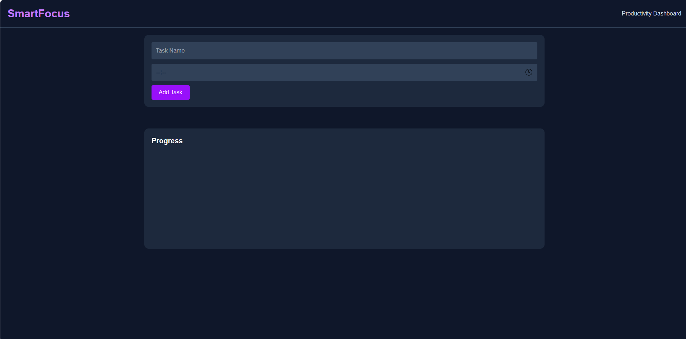

# SmartFocus

> A modern productivity dashboard designed to help users stay focused, manage tasks efficiently, and track their daily progress.


---

## Overview

SmartFocus is a clean and intuitive productivity platform built to simplify task management and improve personal efficiency. It provides users with a distraction-free workspace where they can organize tasks, set deadlines, and monitor progress from a centralized dashboard.

Whether you're a student, developer, freelancer, or professional, SmartFocus helps you stay organized and focused on what matters most.

---

## Features

### Task Management
- Create and organize tasks effortlessly
- Set deadlines and schedules
- Track pending and completed tasks
- Simple and intuitive workflow

### Productivity Tracking
- Monitor task completion progress
- Visual progress dashboard
- Stay aligned with daily goals

### Modern User Experience
- Elegant dark-themed interface
- Responsive design across devices
- Fast and lightweight performance
- Clean and distraction-free layout

---

## Preview

<p align="center">
  
</p>

---

## Tech Stack

| Technology | Purpose |
|------------|---------|
| React.js | Frontend Framework |
| Vite | Build Tool |
| JavaScript (ES6+) | Application Logic |
| HTML5 | Structure |
| CSS3 | Styling & Responsiveness |

---

## Project Structure

```bash
SmartFocus/
│
├── public/
│
├── src/
│   ├── components/
│   ├── App.jsx
│   ├── main.jsx
│   └── index.css
│
├── package.json
├── package-lock.json
├── vite.config.js
└── README.md
```

---

## Getting Started

### Clone the Repository

```bash
git clone https://github.com/your-username/SmartFocus.git
```

### Navigate to the Project

```bash
cd SmartFocus
```

### Install Dependencies

```bash
npm install
```

### Start Development Server

```bash
npm run dev
```

Open your browser and visit:

```text
http://localhost:5173
```


---

## Why SmartFocus?

✔ Improve productivity

✔ Organize daily tasks effectively

✔ Maintain focus on priorities

✔ Track progress visually

✔ Modern and user-friendly interface

---

## Contributing

Contributions are welcome and appreciated.

1. Fork the repository
2. Create a feature branch

```bash
git checkout -b feature/amazing-feature
```

3. Commit your changes

```bash
git commit -m "Add amazing feature"
```

4. Push to GitHub

```bash
git push origin feature/amazing-feature
```


---

## Author

### Sahil Gurav

Full Stack Developer • AI/ML Enthusiast • Researcher

GitHub: https://github.com/SahilGurav1008

---

<div align="center">

### SmartFocus — Focus Better. Achieve More.

⭐ Star this repository if you found it useful.

</div>